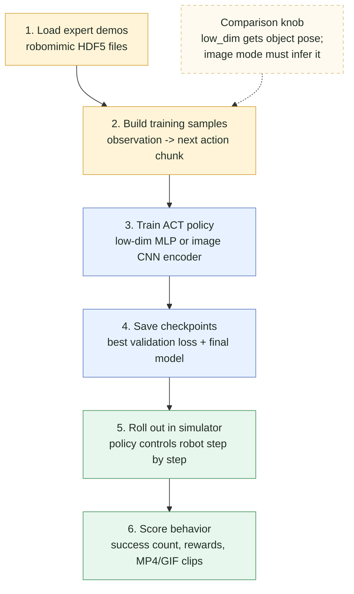
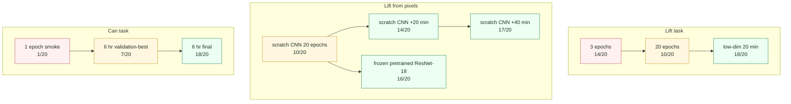
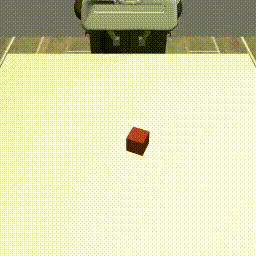
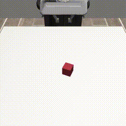
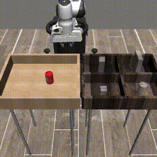
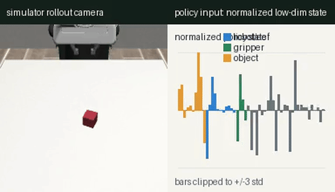
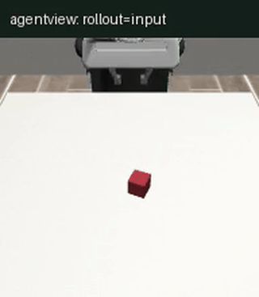
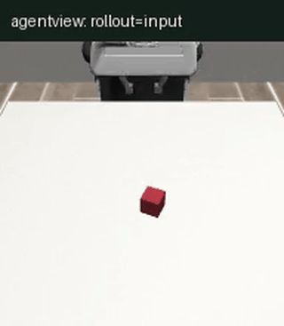

# ACT in One File

[](https://www.python.org/)
[](https://pytorch.org/)
[](https://robomimic.github.io/)
[](https://github.com/astral-sh/uv)
[](https://docs.pytest.org/)

A small, readable PyTorch reimplementation of an ACT-style behavior cloning
loop for robomimic demonstrations.

This is meant to be a friendly demo project: compact enough to read in one
sitting, but real enough to download public robot data, train a transformer
policy, roll it out in robosuite, save MP4s, and inspect the training curves.

## How The Demo Works

Training uses expert demonstrations: at each timestep the dataset contains an
observation and the action the expert took. In low-dimensional mode, the
observation includes privileged simulator state such as object pose. In image
mode, the policy gets a camera frame plus robot proprioception and has to infer
object pose from pixels. ACT learns to predict a short chunk of future actions
from the current observation. Evaluation is different: the learned policy
controls the simulator step by step, and we count whether the task actually
succeeds.



## What This Is

- A one-file training and evaluation script: [act.py](act.py).
- A compact Action Chunking Transformer-style policy that predicts chunks of
  future robot actions.
- A CVAE-style latent path for multimodal action chunks.
- A robomimic low-dimensional baseline using public `lift-ph` and `can-ph`
  datasets.
- An experimental image-observation path for comparing a scratch CNN encoder
  against a frozen pretrained ResNet-18 encoder.
- Local observability: `metrics.json`, `history.jsonl`, `rollout_history.jsonl`,
  loss and rollout curves, rollout metrics, and MP4 videos.

## What This Is Not

The strongest low-dimensional results below use privileged simulator state.
That keeps the ACT training loop practical on a laptop, but the policy is
"cheating" compared with a camera-only object pose estimate. The image path is
there to make that gap visible, not to claim state-of-the-art vision imitation.
The current vision runs use robosuite's third-person `agentview` camera, not a
wrist/POV camera. That view can still be occluded by the robot hand; a more
robust version would use multiple cameras, a wrist camera, augmentation, or a
learned state estimator.

## Recent Results

These numbers are from deterministic `z=0` rollouts started from demonstration
initial simulator states. For ACT's CVAE latent, `z=0` means "do not sample a
random behavior style; use the center of the latent space."



| Task | Run | Checkpoint | Horizon | Success | Readout |
| --- | --- | --- | ---: | ---: | --- |
| `lift-ph` | 3 epochs | `best.pt` | 100 | 14/20 | Minimal training already learns some behavior from low-dim state. |
| `lift-ph` | 20 epochs | `best.pt` | 100 | 10/20 | Better validation loss, worse closed-loop behavior. |
| `lift-ph` | low-dim 20 minutes | `best.pt` | 100 | 18/20 | Strongest privileged-state Lift run so far. |
| `lift-ph-image` | scratch CNN, 20 epochs | `best.pt` | 100 | 10/20 | First high-dimensional baseline from pixels plus proprioception. |
| `lift-ph-image` | scratch CNN, +40 minutes | `last.pt` | 100 | 17/20 | Best vision run so far, close to the low-dim baseline. |
| `lift-ph-image` | frozen pretrained ResNet-18, 20 minutes | `best.pt` | 100 | 16/20 | Faster strong start, but late rollout probes degraded. |
| `can-ph` | 1 epoch smoke | `best.pt` | 200 | 1/20 | Barely trained baseline. |
| `can-ph` | 6 hr validation-best | `best.pt` | 200 | 7/20 | Lowest validation loss checkpoint was not the best actor. |
| `can-ph` | 6 hr final | `last.pt` | 200 | 18/20 | Strongest can run so far. |

Here, "validation-best" means the checkpoint with the lowest supervised loss on
held-out expert action chunks. "Final" means the checkpoint from the end of the
training run. The can result is a useful warning: the model that best matches
held-out action chunks is not always the model that completes the task most
often when it controls the simulator.

Two useful lessons showed up quickly:

- Supervised validation loss is useful for debugging whether the model is
  learning from demonstrations.
- Closed-loop rollout success answers the more important demo question: can the
  policy actually complete the task when its own actions affect the next state?
- For `can-ph`, the validation-best checkpoint was not rollout-best. The final
  checkpoint had worse validation loss but much better policy behavior.
- The same pattern showed up in vision Lift: the scratch-CNN final checkpoint
  reached 17/20 successes, while its validation-best checkpoint reached 13/20.

## Rollout Clips

These GIFs are generated from saved rollout MP4s. Each row uses the same task
and the same demonstration start state, so the comparison is about the policy
checkpoint, not a different initial scene.

| Earlier checkpoint | Later checkpoint |
| :---: | :---: |
| **Lift demo_10, 3 epochs: fails**<br> | **Lift demo_10, 20 minutes: succeeds**<br> |
| **Can demo_1, 1 epoch: fails**<br> | **Can demo_1, 6 hr final: succeeds**<br> |

## What The Policy Sees

These clips show what the policy is actually conditioned on. The vision runs use
`agentview_image`, so the rollout view and policy image are the same panel: if
they are identical, the media does not duplicate them. The low-dimensional
baseline is different, so it stays side-by-side: left is the rollout camera,
right is a spatial sketch of the privileged simulator state.

| Low-dim baseline | Scratch CNN | Frozen pretrained ResNet-18 |
| :---: | :---: | :---: |
|  |  |  |

## Quick Start

Install dependencies:

```bash
uv sync --group dev
```

Download the small lift dataset:

```bash
uv run python act.py download --dataset lift-ph
```

Train a quick local policy:

```bash
uv run python act.py train \
  --data data/lift_ph_low_dim.hdf5 \
  --out runs/lift \
  --epochs 3 \
  --batch-size 64 \
  --device mps
```

Use `--device cpu` if you are not on Apple Silicon. Use `--device cuda` if your
PyTorch install has CUDA support.

## Vision Mode

The first vision experiment should be `lift-ph-image` with the scratch CNN. It
uses third-person `agentview_image` plus robot proprioception and deliberately
excludes the privileged robomimic `object` state vector.

```bash
uv run python act.py download --dataset lift-ph-image
```

The downloaded file is a raw robomimic state/action file. Render a compact
image-observation training file before training:

```bash
uv run python act.py render-images \
  --data data/lift_ph_image.hdf5 \
  --out data/lift_ph_agentview_20demos.hdf5 \
  --max-demos 20 \
  --width 128 \
  --height 128
```

Train the scratch-CNN version:

```bash
uv run python act.py train \
  --data data/lift_ph_agentview_20demos.hdf5 \
  --out runs/lift_vision_scratch \
  --obs-mode image \
  --vision-backbone scratch_cnn \
  --epochs 20 \
  --batch-size 64 \
  --device mps
```

Evaluate it the same way as the low-dimensional checkpoint:

```bash
uv run python act.py evaluate \
  --checkpoint runs/lift_vision_scratch/best.pt \
  --data data/lift_ph_agentview_20demos.hdf5 \
  --out-dir runs/lift_vision_scratch_eval \
  --episodes 20 \
  --videos 3 \
  --device mps
```

For the pretrained comparison, install the optional vision extra and freeze a
pretrained ResNet-18 image encoder:

```bash
uv sync --group dev --extra vision

uv run --extra vision python act.py train \
  --data data/lift_ph_agentview_20demos.hdf5 \
  --out runs/lift_vision_resnet18_frozen \
  --obs-mode image \
  --vision-backbone resnet18 \
  --vision-pretrained \
  --freeze-vision \
  --epochs 20 \
  --batch-size 64 \
  --device mps
```

The useful comparison is not just loss. Run the same rollout evaluation for
both checkpoints and compare success rate, failure modes, and MP4/GIF clips.
For longer runs, add closed-loop probes during training so the run records task
success as well as supervised train/validation loss:

```bash
uv run python act.py train \
  --data data/lift_ph_agentview_20demos.hdf5 \
  --out runs/lift_vision_scratch_continue \
  --resume runs/lift_vision_scratch/last.pt \
  --obs-mode image \
  --vision-backbone scratch_cnn \
  --epochs 10000 \
  --max-minutes 20 \
  --batch-size 64 \
  --device mps \
  --eval-before-train \
  --eval-every-epochs 50 \
  --eval-episodes 10 \
  --eval-max-steps 100
```

This writes `rollout_history.jsonl`. `plot-history` will also generate
`rollout_curve.svg` when rollout probes are present.

Current local Lift comparison:

| Policy | Observation | Checkpoint | Rollout result |
| --- | --- | --- | --- |
| Low-dim ACT, 20 min | Robot state plus privileged object state | `best.pt` | 18/20 successes |
| Scratch-CNN ACT, 20 epochs | `agentview_image` plus robot proprioception | `best.pt` | 10/20 successes |
| Scratch-CNN ACT, 20 min | `agentview_image` plus robot proprioception | `best.pt` | 5/20 successes |
| Scratch-CNN ACT, 20 min | `agentview_image` plus robot proprioception | `last.pt` | 9/20 successes |
| Scratch-CNN ACT, +20 min with rollout probes | `agentview_image` plus robot proprioception | `best.pt` | 12/20 successes |
| Scratch-CNN ACT, +20 min with rollout probes | `agentview_image` plus robot proprioception | `last.pt` | 14/20 successes |
| Scratch-CNN ACT, +40 min with rollout probes | `agentview_image` plus robot proprioception | `best.pt` | 13/20 successes |
| Scratch-CNN ACT, +40 min with rollout probes | `agentview_image` plus robot proprioception | `last.pt` | 17/20 successes |
| Frozen pretrained ResNet-18 ACT, 20 min with rollout probes | `agentview_image` plus robot proprioception | `best.pt` | 16/20 successes |
| Frozen pretrained ResNet-18 ACT, 20 min with rollout probes | `agentview_image` plus robot proprioception | `last.pt` | 16/20 successes |

The scratch-CNN result is intentionally not presented as solved. It is the
first high-dimensional baseline: less privileged than low-dim, clearly learning
something, and currently more brittle.

To inspect what a rollout is actually using as policy input, save a comparison
MP4/GIF:

```bash
uv run python act.py observe-rollout \
  --checkpoint runs/lift_vision_scratch/best.pt \
  --data data/lift_ph_agentview_20demos.hdf5 \
  --out-dir runs/lift_vision_scratch_observe \
  --demo-index 10 \
  --device mps
```

For image checkpoints, `--camera` means "the camera image fed to the policy".
`--view-camera` optionally chooses a different rollout display camera. When
both are `agentview`, the output is a single panel because the viewer and policy
input are the same image. To compare a wrist-style view against the actual
trained policy input:

```bash
uv run python act.py observe-rollout \
  --checkpoint runs/lift_vision_scratch/best.pt \
  --data data/lift_ph_agentview_20demos.hdf5 \
  --out-dir runs/lift_vision_scratch_observe_wrist \
  --demo-index 10 \
  --camera agentview \
  --view-camera robot0_eye_in_hand \
  --device mps
```

## Roll Out A Policy

Save one MP4:

```bash
uv run python act.py rollout \
  --checkpoint runs/lift/best.pt \
  --data data/lift_ph_low_dim.hdf5 \
  --out runs/lift/rollout.mp4 \
  --device mps
```

Run a batch of closed-loop attempts:

```bash
uv run python act.py evaluate \
  --checkpoint runs/lift/best.pt \
  --data data/lift_ph_low_dim.hdf5 \
  --out-dir runs/lift_eval \
  --episodes 20 \
  --videos 3 \
  --device mps
```

Outputs:

- `runs/lift_eval/eval_metrics.json`
- `runs/lift_eval/videos/rollout_*.mp4`

## Train Longer

For a more meaningful demo run, train by wall-clock time and keep a full loss
history:

```bash
uv run python act.py train \
  --data data/lift_ph_low_dim.hdf5 \
  --out runs/lift_20min \
  --epochs 10000 \
  --max-minutes 20 \
  --batch-size 64 \
  --device mps
```

Training writes:

- `best.pt`: checkpoint with the lowest validation loss
- `last.pt`: final checkpoint
- `metrics.json`: compact run summary
- `history.jsonl`: one JSON row per epoch
- `rollout_history.jsonl`: optional closed-loop probes when `--eval-every-epochs`
  is set

Generate a loss curve:

```bash
uv run python act.py plot-history \
  --run runs/lift_20min \
  --title lift_20min
```

Outputs:

- `runs/lift_20min/loss_curve.svg`
- `runs/lift_20min/history_summary.json`
- `runs/lift_20min/rollout_curve.svg`, if the run has rollout probes
- `runs/lift_20min/rollout_summary.json`, if the run has rollout probes

## Try The Can Task

`can-ph` is larger and harder than `lift-ph`:

```bash
uv run python act.py download --dataset can-ph
uv run python act.py train \
  --data data/can_ph_low_dim.hdf5 \
  --out runs/can \
  --epochs 10000 \
  --max-minutes 60 \
  --batch-size 64 \
  --max-demos 100000 \
  --device mps
```

Evaluate with a longer horizon:

```bash
uv run python act.py evaluate \
  --checkpoint runs/can/last.pt \
  --data data/can_ph_low_dim.hdf5 \
  --out-dir runs/can_eval \
  --episodes 20 \
  --videos 5 \
  --max-steps 200 \
  --device mps
```

## Explore Latents

ACT uses a latent variable during training to represent different plausible
action chunks. This command compares `z=0` with sampled latents from the same
initial state:

```bash
uv run python act.py latent-sweep \
  --checkpoint runs/lift/best.pt \
  --data data/lift_ph_low_dim.hdf5 \
  --out-dir runs/lift_latents \
  --samples 8 \
  --videos 9 \
  --device mps
```

## Repo Map

- [act.py](act.py): download, dataset, model, train, plot, rollout, evaluate.
- [ACT_walkthrough.ipynb](ACT_walkthrough.ipynb): step-by-step walkthrough with
  shapes.
- [tests/test_act.py](tests/test_act.py): lightweight smoke tests.
- [docs/work-log.md](docs/work-log.md): concise dated experiment notes.
- [docs/vision-results.md](docs/vision-results.md): compact vision-run metrics
  and artifact paths.

Generated datasets, checkpoints, logs, and videos live under `data/` and
`runs/`; both are ignored by git.

## Development

Run tests:

```bash
uv run pytest -q
```

The project is intentionally small. If you are reading this to learn ACT, start
with [act.py](act.py), then run a short `lift-ph` training job and watch one
rollout video. That loop gives the fastest intuition.
