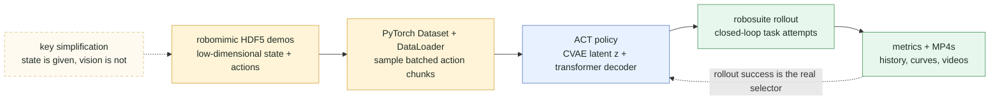
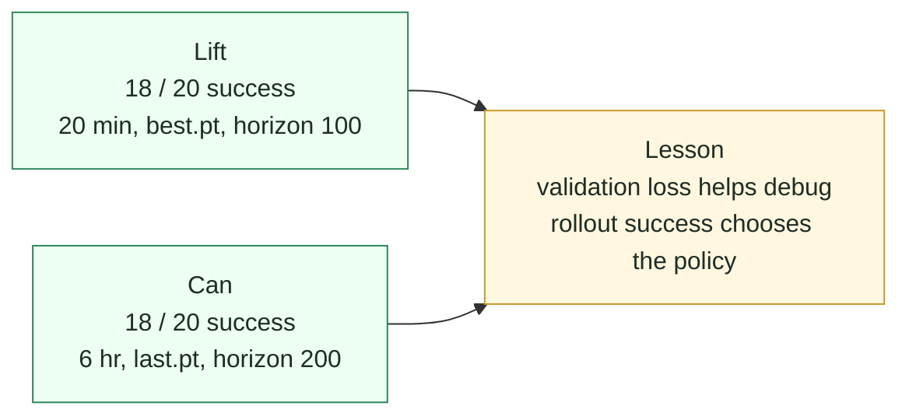

# ACT in One File

[](https://www.python.org/)
[](https://pytorch.org/)
[](https://robomimic.github.io/)
[](https://github.com/astral-sh/uv)
[](https://docs.pytest.org/)

A small, readable PyTorch reimplementation of an ACT-style behavior cloning
loop for robomimic demonstrations.

This is meant to be a friendly demo project: compact enough to read in one
sitting, but real enough to download public robot data, train a transformer
policy, roll it out in robosuite, save MP4s, and inspect the training curves.



## What This Is

- A one-file training and evaluation script: [act.py](act.py).
- A compact Action Chunking Transformer-style policy that predicts chunks of
  future robot actions.
- A CVAE-style latent path for multimodal action chunks.
- A robomimic low-dimensional demo pipeline using public `lift-ph` and `can-ph`
  datasets.
- Local observability: `metrics.json`, `history.jsonl`, `loss_curve.svg`,
  rollout metrics, and MP4 videos.

## What This Is Not

This repo currently trains from privileged low-dimensional simulator state, not
camera images. That keeps the demo practical on a laptop and makes the ACT
training loop easy to understand. A vision-based ACT would need image
observations plus a visual encoder.

## Recent Results

These numbers are from deterministic `z=0` rollouts started from demonstration
initial simulator states.



| Task | Data | Training | Checkpoint | Horizon | Success |
| --- | ---: | ---: | --- | ---: | ---: |
| `lift-ph` | 20 demos | 20 min | `best.pt` | 100 | 18/20 |
| `can-ph` | 200 demos | 6 hr | `last.pt` | 200 | 18/20 |

Two useful lessons showed up quickly:

- Supervised validation loss is helpful, but closed-loop rollout success is the
  real metric.
- For `can-ph`, the validation-best checkpoint was not rollout-best. The final
  checkpoint had worse validation loss but much better policy behavior.

## Quick Start

Install dependencies:

```bash
uv sync --group dev
```

Download the small lift dataset:

```bash
uv run python act.py download --dataset lift-ph
```

Train a quick local policy:

```bash
uv run python act.py train \
  --data data/lift_ph_low_dim.hdf5 \
  --out runs/lift \
  --epochs 3 \
  --batch-size 64 \
  --device mps
```

Use `--device cpu` if you are not on Apple Silicon. Use `--device cuda` if your
PyTorch install has CUDA support.

## Roll Out A Policy

Save one MP4:

```bash
uv run python act.py rollout \
  --checkpoint runs/lift/best.pt \
  --data data/lift_ph_low_dim.hdf5 \
  --out runs/lift/rollout.mp4 \
  --device mps
```

Run a batch of closed-loop attempts:

```bash
uv run python act.py evaluate \
  --checkpoint runs/lift/best.pt \
  --data data/lift_ph_low_dim.hdf5 \
  --out-dir runs/lift_eval \
  --episodes 20 \
  --videos 3 \
  --device mps
```

Outputs:

- `runs/lift_eval/eval_metrics.json`
- `runs/lift_eval/videos/rollout_*.mp4`

## Train Longer

For a more meaningful demo run, train by wall-clock time and keep a full loss
history:

```bash
uv run python act.py train \
  --data data/lift_ph_low_dim.hdf5 \
  --out runs/lift_20min \
  --epochs 10000 \
  --max-minutes 20 \
  --batch-size 64 \
  --device mps
```

Training writes:

- `best.pt`: checkpoint with the lowest validation loss
- `last.pt`: final checkpoint
- `metrics.json`: compact run summary
- `history.jsonl`: one JSON row per epoch

Generate a loss curve:

```bash
uv run python act.py plot-history \
  --run runs/lift_20min \
  --title lift_20min
```

Outputs:

- `runs/lift_20min/loss_curve.svg`
- `runs/lift_20min/history_summary.json`

## Try The Can Task

`can-ph` is larger and harder than `lift-ph`:

```bash
uv run python act.py download --dataset can-ph
uv run python act.py train \
  --data data/can_ph_low_dim.hdf5 \
  --out runs/can \
  --epochs 10000 \
  --max-minutes 60 \
  --batch-size 64 \
  --max-demos 100000 \
  --device mps
```

Evaluate with a longer horizon:

```bash
uv run python act.py evaluate \
  --checkpoint runs/can/last.pt \
  --data data/can_ph_low_dim.hdf5 \
  --out-dir runs/can_eval \
  --episodes 20 \
  --videos 5 \
  --max-steps 200 \
  --device mps
```

## Explore Latents

ACT uses a latent variable during training to represent different plausible
action chunks. This command compares `z=0` with sampled latents from the same
initial state:

```bash
uv run python act.py latent-sweep \
  --checkpoint runs/lift/best.pt \
  --data data/lift_ph_low_dim.hdf5 \
  --out-dir runs/lift_latents \
  --samples 8 \
  --videos 9 \
  --device mps
```

## Repo Map

- [act.py](act.py): download, dataset, model, train, plot, rollout, evaluate.
- [ACT_walkthrough.ipynb](ACT_walkthrough.ipynb): step-by-step walkthrough with
  shapes.
- [tests/test_act.py](tests/test_act.py): lightweight smoke tests.
- [docs/work-log.md](docs/work-log.md): concise dated experiment notes.

Generated datasets, checkpoints, logs, and videos live under `data/` and
`runs/`; both are ignored by git.

## Development

Run tests:

```bash
uv run pytest -q
```

The project is intentionally small. If you are reading this to learn ACT, start
with [act.py](act.py), then run a short `lift-ph` training job and watch one
rollout video. That loop gives the fastest intuition.
